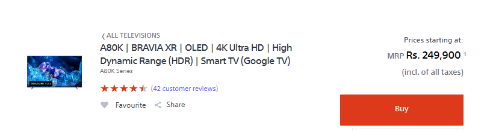

# Dom Manipulation Assignment

1. Webiste Name: [Dev To](https://dev.to/)

### Topics

    - Query Selctory, Inner HTML

### Sample Image


### Tasks

        Target the Top description div and change the DEV Community to <Your_Name> and description to your passion

**CODE:**
```
document.querySelector(".side-bar .crayons-card .crayons-subtitle-2").innerHTML="Shakya";
document.querySelector(".side-bar .crayons-card .color-base-70").innerHTML="I Write Code";
```

### Output


2. Website Name: [Apple](https://support.apple.com/en-in)

### Task


### Fetch all the product name and store in an array


**CODE:**

```
let mainDiv=document.querySelectorAll(".row .as-imagegrid-item a .as-imagegrid-item-title");
let storedArray=[];
for(let i=0;i<mainDiv.length;i++){
    storedArray.push(mainDiv[i].textContent.split(" ")[0]);
}
console.log(storedArray);
```

### Output

['iPhone', 'Mac', 'iPad', 'Watch', 'AirPods', 'Music', 'TV']

3. Webiste Name: [Youtube Support](https://support.google.com/youtube/)

### Topics

    - Get Element By Id, Create Element, Create Text Node, Append Child

### Sample Image


### Tasks

     Add another FAQ 'My New FAQ' to the list

**CODE:**
```
let newNavItem=document.createElement("section");
newNavItem.classList.add("parent");
let newHeader=document.createElement("h3");
newHeader.textContent="My New FAQ";
newNavItem.appendChild(newHeader);
document.querySelector(".accordion-homepage").appendChild(newNavItem);
```

### Output


4. Webiste Name: [OnePlus](https://www.oneplus.in/support)

### Topics

     Query Selector, InnerText

### Sample Image


### Tasks

      Change the contact number

**CODE:**
```
document.querySelector(".customer-support .one-tel-number").innerText="+91 6366256689";
```

### Output


5. Webiste Name: [Samsung](https://www.samsung.com/in/offer/online/samsung-fest/)

### Topics

       getElementById, createElement, InnerText, append, setAttribute

### Sample Image


### Tasks

     Target the main div of card and change the Button text to Check out

**CODE:**
```
let buttons=document.querySelectorAll(".swiper-wrapper .feature-column-carousel__item .feature-column-carousel__feature .feature-column-carousel__content .feature-column-carousel__button .cta--contained");
for(btn of buttons){
    btn.innerText="Check Out";
}
```

### Output


6. Webiste Name: [Adidas](https://www.adidas.co.in/)

### Topics

    -   Query Selector, Event listeners, Changing Styles

### Sample Image


### Tasks

     Target the search box and on hover change thebackground color to red.
**CODE:**

```
let el=document.querySelector(".searchinput-wrapper___18TsX form .searchinput___zXLAR");
el.addEventListener("mouseover",()=>{
    el.style.backgroundColor="red";
});
el.addEventListener("mouseout",()=>el.style.backgroundColor="#CAD5E2");
```

### Output


7. Webiste Name: [MDN Web Docs](https://developer.mozilla.org/en-US/)

### Topics

       Form, Value, Submit

### Sample Image


### Tasks

     To Search a topic in the MDN Search bar.
     First add a text to search in the search bar and then hit the submit search button to search the docs using DOM

**CODE:**
```
function search(val) {
  let input = document.querySelector("#top-nav-search-input");
  input.value = val;
  let form = document.querySelector("#top-nav-search-form");
  form.submit();
}
let userInput=prompt("Enter the keyword you want to search");
search(userInput);
```

### Output


8. Webiste Name: [Google](https://www.google.com/)

### Topics

       Remove Elements

### Sample Image


### Tasks

     Remove alternate languages from the home page languages listed

**CODE:**
```
let languages=document.querySelectorAll("#SIvCob a");
for(let i=0;i<languages.length;i++){
    if(i%2===0)
        languages[i].remove();
}  
```

### Output


9. Webiste Name: [Code Wars](https://www.codewars.com/)

### Topics

       Change Font Family, Color of Text.

### Sample Image


### Tasks

    Change the font family of the text to monospace and text color to the logo’s background color.

**CODE:**
```
document.querySelector(".display-heading-1").style.color="#b1361e";
document.querySelector(".display-heading-1").style.fontFamily="monospace";

```

### Output


10. Webiste Name: [Freecodecamp](https://www.freecodecamp.org/)

### Topics

       querySelector, mouseover, click eventListener,  callback function, style,

### Sample Image


### Tasks

    Target the button and change background colour on mouseover

**CODE:**
```
let btn=document.querySelector(".btn-cta-big .login-btn-text");
btn.addEventListener("mouseover",()=>btn.style.backgroundColor="red");
```

### Output


11. Webiste Name: [realme](https://www.realme.com/in/)

### Topics

       querySelector,style,background-image

### Sample Image


### Tasks

    change the realme logo to ineuron logo

**CODE:**
```
document.querySelector(".logo span").style.backgroundImage="url(https://ineuron.ai/images/ineuron-logo.png)";

```

### Output


12. Webiste Name: [Github](https://github.com/)

### Topics

       querySelector,style,background-Color

### Sample Image


### Tasks

     change the background colour of the button to blue.

**CODE:**
```
document.querySelector(".f4 a").style.backgroundColor="blue"
```

### Output


13. Webiste Name: [Hackerrank](https://www.hackerrank.com/)

### Topics

       querySelector,innerHtml

### Sample Image


### Tasks

Target the top description and change “Matching developers with great companies” to “JSBOOTCAMP“.

**CODE:**
```
document.querySelector(".fl-heading-text").innerHTML="JSBOOTCAMP"
```

### Output


14. Webiste Name: [Asus](https://www.asus.com/in/)

### Topics

      querySelector,style,font-size

### Sample Image


### Tasks

       change the fontsize of “Hot Deals” to 80px

**CODE:**
```
document.querySelector(".HotDealsAll__Heading__2fIbe").style.fontSize="80px"
```

### Output


15. Webiste Name: [Dell](https://www.dell.com/en-in/shop/deals/laptop-deals?gacd=10415953-9016-5761040-285981356-0&dgc=ST&gclid=Cj0KCQjwguGYBhDRARIsAHgRm4-XUDMhhVNyHXb3s1gY4ZBzORr_d9Se-buhJwy7asyUe7YdqEA11eEaAt6UEALw_wcB&gclsrc=aw.ds&nclid=BxjBlpBQsX6pjSHh-L8YYSU77EpfXRkG1AGMB5Wbeu386ykspfrPDnfx_DdFau20)

### Topics

      querySelector,style.textAlign

### Sample Image


### Tasks

       Convert the text “G15 Gaming Laptop” from left to right

**CODE:**
```
const texts= document.querySelectorAll(".ps-title");
texts.forEach((text)=>{text.style.textAlign = "right";});
```

### Output


16. Webiste Name: [Vercel](https://vercel.com/)

### Topics

     querySelector,innerHTMl


### Sample Image


### Tasks

      change the heading “Start with the developer” to “Start with Scratch”

**CODE:**
```
document.querySelector(".section-title_title__VEDfK").innerText="Start with Scratch";
```

### Output


17. Webiste Name: [Sony](https://www.sony.co.in/)

### Topics

    querySelector,innerHTMl

### Sample Image



### Tasks

     change the button text To current Date.

**CODE:**
```
const date = new Date();
document.querySelector('.btn-container').textContent = date;
```

### Output


18. Webiste Name: [Philips](https://www.philips.co.in/)

### Topics

     querySelector,style,backgroundcolor

### Sample Image


### Tasks

    change the background colour blue to orange

**CODE:**
```
document.querySelector(".p-footer").style.backgroundColor="orange";
```

### Output


19. Webiste Name: [Canon](https://in.canon/)

### Topics

          querySelector,src

### Sample Image


### Tasks

    extract the canon logo

**CODE:**
```
console.log(document.querySelector(".navbar-brand img").src)
```

### Output


20. Webiste Name: [Oppo](https://www.oppo.com/in/)

### Topics

          querySelector,style,color

### Sample Image


### Tasks

      Change the description colour black to orange

**CODE:**
```
document.querySelectorAll(".desc").forEach((el)=>el.style.color="orange");
```

### Output


